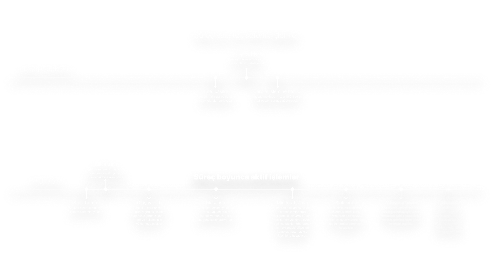

# Bilgisayar bilimleri tarihi
<!-- markdownlint-disable MD033 -->

Kod yazmadan önce bilmeniz gereken çok şey var.

Bilgisayar bilimleri çook eski bir konsept.
Son 60 yıldaki internet gibi yenilikler bilgisayara çok sihirli bir anlam yüklüyor.
Bu yüzden bilgisayar "bilgi sayıyormuş", bişeyler yapıyormuş gibi hissediyoruz.

Ama günün sonunda hepsibir avuç matematik formülü.

**BİLGİSAYAR YANLIŞ BİR SÖZCÜK!**

Bilgisayarlar bilgi saymaz, hesaplama yapar.

Türkçemizde bir "yanlış teknik isimlendirme" problemi var; buna en iyi örnek RAM ve Anabellek terimleştirilmesi.
RAM bir sözcük değildir, bir kısaltmadır.
Buna rağmen çevirisi "Anabellek" olarak kullanılır.
Bu mantıksızdır; RAM "Rastgele erişilebilen hafıza" demektir, "Ana" olan hiçbir kısmı yoktur.

<details>
<summary>Aslında bu amaç için türetilmedi, ama yanlış kullanılıyor.</summary>
"Ana Bellek" (Main Memory) terimi, modern von Neumann mimarisindeki işlevsel rolünden gelir. Yani kelimenin çevirisi değil, mimarideki görevinin adıdır.
</details>

Bilgisayar da bilgi saymaz, nasıl sayacak ki?
Senin söylemen lazım; programlaman.

<details>
<summary>Temelde anlam aslında yine iyi, ama yanlış anlaşılıyor.</summary>
Bu kelimeyi Türkçeye kazandıran Prof. Dr. Aydın Köksal'dır ve "saymak" fiilini sadece "1, 2, 3" diye saymak anlamında değil, "verileri işlemek, dökmek ve tasnif etmek" (information processing) anlamında türetmiştir.
</details>

Bu isimlendirme konuları nedeniyle ingilizce, veya Avrupa dilleri üzerinden düşünmeniz gerek.
Çünkü bilgisayar bilimleri Türkçede kolayca anlaşılabilecek bir durumda değil.
Kod yazımları da ingilizcedeki dil yapısına daha yakın.
Ama korkmayın, yolda ingilizce öğrenebilirsiniz.

Bilgisayar sözcüğü, yanlış anlaşılmaya kurban gitmiştir.

İngilizcede bilgisayarlara "Computer" (kom-pü-ter) yani "Hesaplayıcı" denir.
Hesap makinesi ile aynı şey değil; hesap makinesi çoğu zaman tek bir hesaplama yapar ve sonuç verir.



"Computer", planlanan şekilde matematiksel formülleri kullanarak sıralı matematiksel hesaplamalarda bulunur ve bu hesaplamaları çeşitli işler için kullanır.
Planlanan derken, "Plan" zaten "Program" demektir.
E planı yazarız, Program da "Yazılım" demektir.
Biz bilgisayarlara bi program çıkarıyoruz, ders programı çıkarır gibi; onlar da bizim söylediklerimizi yapıyor.

"Computer"in parladığı konum da hesaplamaları bir programa göre yapması, bu sonuçları programlar arası veya içi bir şekilde kullanmasıdır.

"E peki hiç çarpma bölme işlemi yapmadığım bir uygulama nasıl çalışıyor?" sorusu çok mantıklı ve basit; sen yapmıyorsun ama, senin için yapıyorlar.

Kullandığın yazılım dili yapmak istediğin şeyi bir çeviri aracından geçirerek makinanın anlayacağı şekle getiriyor.
Çeviren alete "Compiler" yani derleyici diyoruz.

Genellikle Assembly gibi daha alt seviye diller üzerinden makinenin anlayacağı elektrik sinyallerine dönüştürür
Bu seviyede işlemcin (CPU), yani bilgisayarı çekip çeviren çip (bir parça) denilenleri hemen anlıyor.
Bunun da bir alt seviyesinde, CPU verdiğin her bir emiri aslında elektrik seviyesinde matematiksel işlem yaparak anlıyor.

İşlemciler transistörlerden oluşur.
Bu transistörler matematiksel hesaplamaları yapmamızı sağlayan arkadaşların ta kendisi!
Transistörleri kullanarak gelen elektrik sinyalleri ile matematiksel işlemler yapabiliyoruz.

"E bilgisayarlar 0 ve 1ler ile çalışmıyor mu, nasıl 9x3'ü hesaplıyoruz?"
Eğer işleri 0 ve 1 kullanıyoruz diye basitleştirirsek evet, saçma derecede yetersiz geliyor bu sayılarla sınırlı kalmak.
Ama işin aslı öyle değil; biz binary kullanıyoruz.

Binary, veya "ikilik sistem"; sayarken 10 parmağımız yerine sadece ellerimizi kullanmamız demek.
Şuan 23 sayısını göstermek için ellerinizle ne yaparsınız? 2 tane on, bir tane 3.
Binary'de de aynısını yapıyoruz! Eğer tek seferde sayıyı gösteremezsek, daha fazla elimizdeki sayıları kullanıyoruz.

Binary'de sayılar şöyle gözükür:
*(Decimal - Binary)*

```text
0  = 0
1  = 1
2  = 10
3  = 11
4  = 100
5  = 101
6  = 110
7  = 111
8  = 1000
9  = 1001
10 = 1010
11 = 1011
```

10luk sistemde 0-9 arası tek haneli, 10'da ikinci haneye geçiyorsun — binary'de bu 2'de oluyordu:

```text
0  = 0
1  = 1
2  = 2
3  = 3
4  = 4
5  = 5
6  = 6
7  = 7
8  = 8
9  = 9
10 = 10
11 = 11
```

Binary 2 sembolle (0,1) çalıştığı için 2'de taşıyor, decimal 10 sembolle (0-9) çalıştığı için 10'da taşıyor. Mantık aynı, sembol sayısı farklı.

Yani sembol yetmezse yeni haneye geçersin.

2 işaret ile sayı göstermeye "binary", 10 işaret ile sayı göstermeye "decimal", veya sümerlerin kullandığı 60lık sistemdeki gibi 60 adet temel birim (yani işaret) kullanmaya "seksagesimal" denir.

"9x3 nasıl hesaplanıyor, haneler tamam ama işlem nasıl oluyor?" [Boolean algebra](https://en.wikipedia.org/wiki/Boolean_algebra) yani [Boole cebiri](https://tr.wikipedia.org/wiki/Boole_cebiri) ile!

Transistörler, Boolean algebra ile tanımlanan [mantık kapılarını](https://tr.wikipedia.org/wiki/Mant%C4%B1ksal_kap%C4%B1) ([logic gate](https://en.wikipedia.org/wiki/Logic_gate)) oluşturur.
Bu kapılar bir araya gelince toplama, çarpma gibi işlemler yapabilen devreler ortaya çıkar.
9x3 de sonunda bu devrelerde hesaplanıyor.
